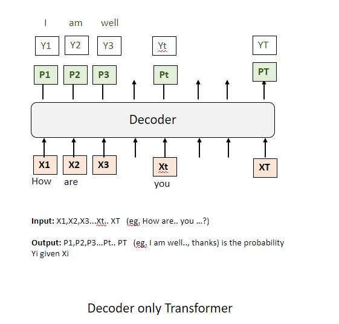
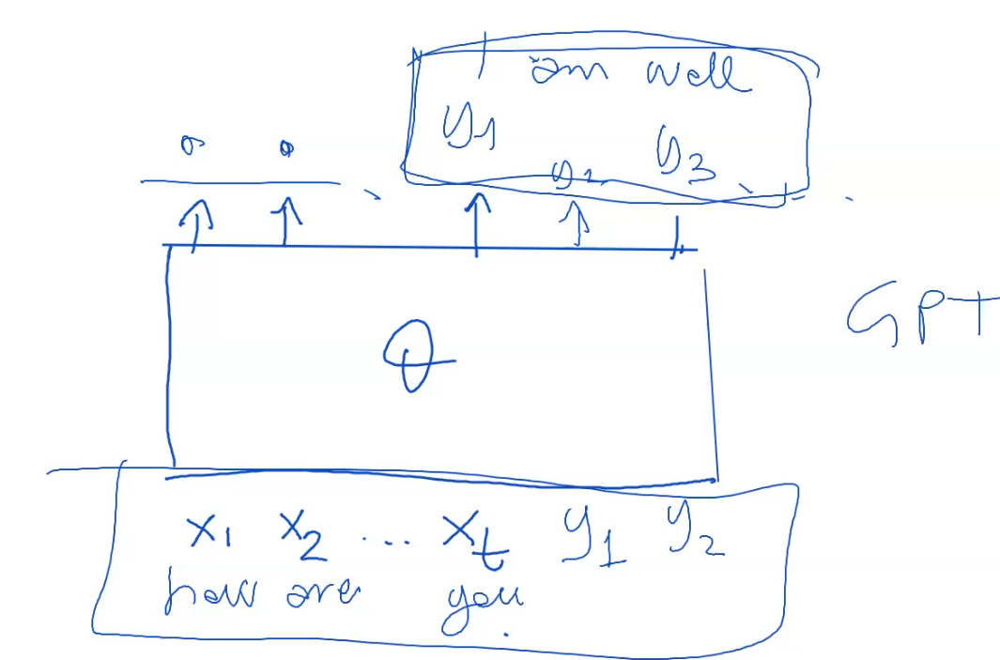
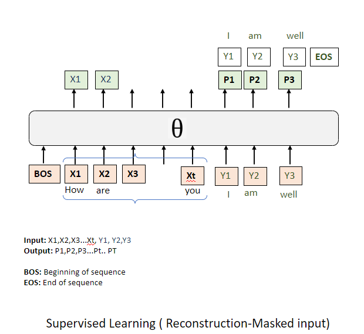
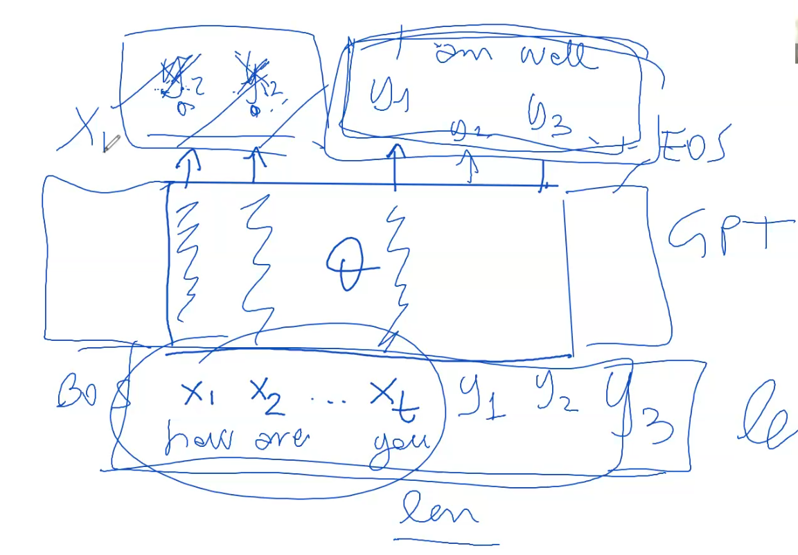

# Decoders
This repository explains how a decoder-only transformer (GPT) work vs an encoder-decoder Transformer . This repository is based on the material provided by  Prof. Massimo Piccardi, NLP lab.

## 1. Overview of Decoder-Only Transformer Architecture

Conceptually, the decoder acts as a module that receives a sequence of input tokens, which can be denoted as  $(x_1, x_2, ..., x_t, ..., x_T$). Corresponding to this sequence, the decoder produces an output sequence of probability vectors $(p_1, p_2, ..., p_t, ..., p_T$).
Each of these probability vectors is dimensionally aligned with the size of the  vocabulary we are employing. For instance, if the vocabulary incorporates 50,000 distinct words, then each vector, $p_i$, is a 50,000-dimensional vector where $i$ ranges from 1 to $T$. Each element within these vectors signifies the probability of a specific word from the vocabulary being the correct output at that position in the sequence.

Mathematically, the size of each probability vector is equivalent to the size of the vocabulary, $V$, leading to $p_i \in \mathbb{R}^V$. The elements of each probability vector are constrained such that each element, $p_{ij}$, satisfies $0 \leq p_{ij} \leq 1$, and the sum of all elements in a single probability vector sums to 1, adhering to the axioms of probability:
$$\sum_{j=1}^{V} p_{ij} = 1$$

Suppose our objective is to train the Decoder by determining the optimal values for all its internal parameters, which we denote collectively as $\theta$. The structure of The decoder is complex, comprising various layers and numerous parameters and weights. Our overarching goal is to adjust $\theta$ in such a way that it enables The decoder to function at its optimal capacity.

During the process of supervised training, we work with a set of definitive tokens, known as the ground truth tokens, which serve as our training targets. These tokens, which we can label as $(y_1, y_2, ..., y_T$), correspond to each position in our sequence, where the vocabulary size is considerable, say 50,000 tokens. For each position in our sequence, we have a specific token that we aim to predict accurately.

The concept of targeting here implies that we strive to enhance the probability within the probability vector for a given token identified as our target to be as maximal as possible. Ideally, this probability is 1, but realistically, it may be slightly less, like 0.9, due to the need to balance across multiple sequences and samples. In mathematical terms, if the target token at position $t$ in the sequence is $y_t$, we aim to maximize the corresponding probability $p_{t,y_t}$ from the probability vector at that position $\max p_{t,y_t}$. However, the model faces a multitude of sequences and samples, each with its own set of input tokens and corresponding output targets. Consequently, our task is to calibrate the values of $\theta$ to strike an optimal balance, elevating the probability for each target token $y_t$ across all training samples, effectively maximizing the likelihood of these target tokens within the constraints of the given data.

 
 **What exactly constitutes our target in more formal terms?** 
 
We aim to maximize the probabilities associated with the target tokens $(y_1, y_2, ..., y_T$) for the given sequence. More precisely, rather than directly maximizing the probabilities, we opt to maximize the logarithm of these probabilities. The rationale behind this choice stems from the challenges associated with optimizing within the narrow range of 0 to 1, including constraints on permissible probability values and the potential for numerical overflow. Crucially, the logarithm function's monotonically increasing nature ensures that the parameters $\theta$ that maximize the probabilities are identical to those maximizing the log of these probabilities. Hence, our core objective – maximizing the probabilities – remains intact, but we approach it by maximising their logarithms.

With multiple tokens in the mix, our objective translates into maximizing the cumulative log probability of the target tokens, given all the input tokens $(x_1, x_2, ..., x_P$) and the set parameters. Mathematically, this goal can be expressed as maximizing the sum:

$$
\sum_{t=1}^{T} \log p(y_t | x_1, x_2, ..., x_P; \theta)
$$

However, by convention, training frameworks favour loss functions, which are framed in terms of minimization. To align with this convention, we introduce a negative sign, transforming the maximization of the log probability into the minimization of its negative. This inversion effectively mirrors the function, converting our search for the maximum into a search for the minimum. This alternative formulation is recognized as the negative log-likelihood or cross-entropy, terms often used interchangeably in the field.

In essence, our training process is designed to minimize:

$$
-\sum_{t=1}^{T} \log p(y_t | x_1, x_2, ..., x_P; \theta)
$$

This approach encapsulates the conventional method of framing and pursuing the optimization objective in supervised learning.

Hence, the training objective is established. Provided with a sequence of input tokens and a corresponding set of target tokens for output, the aim during training is to reduce the negative log-likelihood associated with these target tokens as generated by the decoder.
 
 
 **When can this arrangement be useful?**
 
This module proves particularly effective in scenarios like question-answering or generating responses to prompts. During these tasks, the operation of the Decoder at runtime unfolds as follows: We commence by supplying a subset of input tokens up to a certain juncture; specifically, the initial $t$ tokens are fed into the system. Corresponding to these input slots, the Decoder calculates the probability vectors as previously outlined. However, our interest doesn't lie in these probabilities, except for the probability associated with the final token in this subset, $x_t$.

Our primary focus is on predicting the initial token of the response, denoted as $y_1$. Upon predicting $y_1$, it's then used as the subsequent input token, following $x_t$, the final token of the input sequence. This process aims to predict $y_2$, the second token of the response. We continue this pattern, iteratively feeding each predicted token, $y_2$, $y_3$, and so on, back into the system as the new input. This method ensures that only the first $xt$ tokens are supplied as the prompt, and it's anticipated that the Decoder will sequentially generate the remaining tokens that constitute the response. 

This procedure is inherently sequential, implying that while the initial prompt is available in its entirety from the start, the generation of the response tokens must occur in a step-by-step fashion. Each newly predicted token informs the prediction of the subsequent token.

Such is the nature of the Decoder's function during runtime or inference, systematically constructing a response based on a series of inputs and iterative predictions.

**What are the practical steps for training one of these decoders and readying it for the training phase? How do we actually employ the negative log-likelihood in this context?**
 
The process is straightforward. Consider an example where we're presented with an input sentence, say, "How are you?" and the corresponding response should be "I'm well." Here, "How are you?" represents the input tokens, and "I'm well" embodies the predicted tokens.

At this juncture, the crux of negative log-likelihood is to predict these response tokens effectively, utilizing the input tokens during training. Given that all tokens are accessible at this stage — both from the prompt ("How are you?") and the manually annotated response ("I'm well") — we can directly feed into the system $x_1, x_2, x_3, y_1$, $y_2$ and $y3$. The expectation is that based on these inputs, the decoder will predict $y_1, y_2$, and $y_3$. The operational requirements here are minimal; there's no necessity for a distinct target output for the negative log-likelihood.

As per the operational norms of the GPT library, the entire sequence — comprising both the input and the response — is fed into the decoder. This input isn't just physical; it's also conceptual, as the model might also be designed to predict the end-of-sentence token, thereby recognizing the full length of the sequence and the demarcation of the prefix.

In essence, the training revolves around the decoder recognizing and utilizing the full span of the input sequence while primarily focusing on accurately predicting the subsequent response tokens, as dictated by the negative log-likelihood.

When configuring the negative log-likelihood, the entire sequence, encompassing both the prompt (or prefix) and the response, is supplied to it. However, the system is instructed to apply a mask to a certain number of tokens, a quantity influenced by the prefix's length. This could equate to $t$ or $t - 1$ tokens, depending on the specific requirements of the sequence, thereby designating the response, not the entire sequence, as the primary focus of the negative log-likelihood.

This reconstruction or loss function typically requires four parameters:
 - The complete sequence  integrating both the prompt and the response.
 - The total length of this sequence.
 - The length of the prefix(prompt): provides a clear demarcation for where the prompt concludes and the response begins within the scope of the negative log-likelihood.
 - A 'mask prefix' can be set to either true or false. When set to true, it indicates that the tokens within the prefix are masked. Yet, there's a possibility of configuring the system to predict these prefix tokens, thereby offering a more nuanced objective to the prompt's components. This approach could potentially enhance the internal states of the model, ensuring a more refined predictive capacity for subsequent tokens.

Consequently, the last token of the prompt is aligned to predict the initial token of the response, maintaining the sequential integrity of token prediction. It's plausible that the negative log-likelihood function might include the 'mask prefix' parameter set to false, thereby making both the prefix tokens and the response tokens integral to the model's training targets. The decision between these approaches might not have a clear theoretical superiority, but empirical evidence may favour one over the other.

A subtle variation to this framework could involve incorporating a special 'beginning of sentence' token at the start and also making the very first token of the prompt, $x_1$, a subject of prediction. However, it's not entirely clear whether such a 'beginning of sentence' token is universally employed in GPT or similar transformer architectures. These are minor, nuanced adjustments, yet the core principles we've discussed hold consistently true.

This delineates the operational essence of the decoder-only architecture, elucidating the intricate interplay of inputs, sequence lengths, and the strategic masking of tokens in refining the model's predictive prowess.

 
 
## 2. Encoder-Decoder Architecture
We can succinctly compare this with how a standard transformer operates, one that encompasses both an encoder and a decoder. Briefly put, the architecture of an encoder-decoder is not markedly distinct. It consists of two primary components: the encoder and the decoder. In this arrangement, the separation between the input prompt and the output response is distinctly defined—the input prompt is processed by the encoder, and the output response is generated by the decoder. 

 
 
In our scenario, the input sequence, denoted as $x_1$ through $x_T$, is fed into the encoder, which operates on a fixed length. If the length of the actual prompt is less than this fixed length, padding tokens are used to fill the gap, ensuring uniformity. The encoder, then, doesn't directly generate any probability outputs; these are solely produced by the decoder.

The two modules are connected through a large number of connections, collectively called cross attention. The input tokens are processed and transformed into internal states, which are then communicated to the decoder via the cross attention mechanism.

A beginning-of-sentence token is provided to the decoder as the first token in the input. This allows for the calculation of the probability of the first output token. During training, a reference token, 'y1', is used. In inference, a token is predicted from the probability distribution, typically selecting the token with the highest probability value. This selected token is then used as the input for predicting the next token, 'y2', and the process continues in this manner.

At inference time, one token is predicted at a time. Each predicted token is used as input for the next prediction. This method is known as greedy decoding. An alternative approach is beam decoding or beam search, where multiple predictions are accumulated, but the principle remains the same.

During training, all **input tokens** and the **tokens of the target sentence** are available. The model is trained by providing ***all prompt tokens to the encoder and all response tokens to the decoder, shifted by one position***. The training objective is to maximize the log probability of the target tokens, or equivalently, minimize the negative log-likelihood.

The two architectures, traditional transformer and decoder-only, are very similar. The main difference is that the decoder-only architecture simplifies by eliminating padding tokens and does not require cross-attention, as the self-attention within the single module serves the same function. In the decoder-only architecture, all predictions are informed by the hidden state of every other token in the sentence. This approach may be simpler, which could be a reason for its adoption by OpenAI for GPT.

The important aspect is understanding the training objective and how the architecture operates during runtime.
