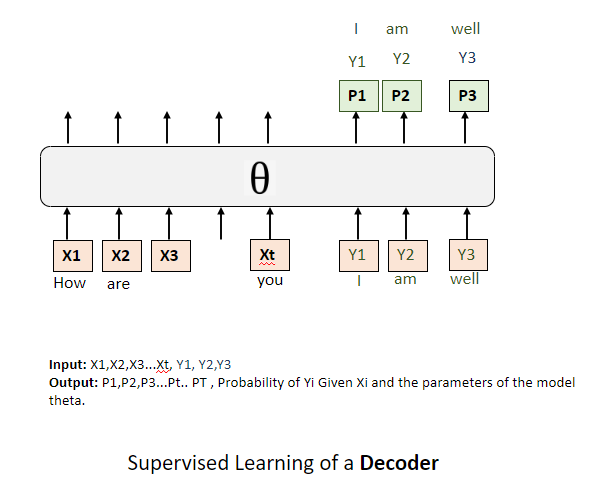
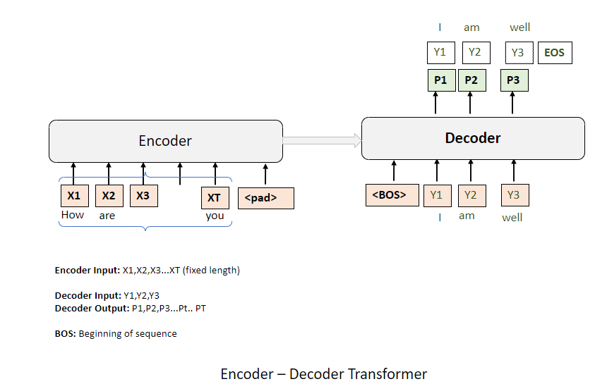

# Decoders
This repository explains how a decoder-only transformer work. This explanation is based on the material provided by  Prof. Massimo Piccardi at the UTS 

## Agenda

1. **Overview of Decoder-Only Transformer Architecture**
    - Definition and primary function of a decoder in transforming input tokens into probability vectors.
    - Impact of vocabulary size on the dimensions of the output vectors.
    - Detailed explanation of the input tokens (x1, x2, ..., xT) and the structure of output probability vectors (p1, p2, ..., pT).
    - The comprehensive size of probability vectors corresponding to each input token.

2. **Training Methodology and Objectives**
    - Strategies for maximizing the likelihood of target tokens (y1, y2, ..., yT).
    - Theoretical justification for maximizing the logarithm of probabilities.
    - Transforming the maximization of log probabilities into a minimization problem.
    - Description of the sequential prediction of response tokens.
    - The cyclical nature of using predicted tokens for further predictions.
    - Supervised training methods for fine-tuning the decoder's parameters (theta).
    - Techniques for aligning the predicted sequence with the target sequence, focusing on minimizing the negative log likelihood.

3. **Distinctive Features of Decoder-Only Architecture**
    - Comparative analysis with traditional transformer models, highlighting the simplifications in decoder-only architecture.
    - Discussion on the advantages of these simplifications and their possible reasons for inclusion in models like GPT.
    - Recap of the decoder-only transformer's ability to generate textual sequences.
    - The significance of the training phase in reducing the discrepancy between predicted and target sequences.

# **1. Overview of Decoder-Only Transformer Architecture**

 

These probability vectors have the size of the vocabulary that we are using. So say we are using a vocabulary with 50,000 words, each of these probability vectors demand, for instance, is 50,000 that's in size. So it's a huge with the same number is entries as the vocabulary, with a size equal to the same number of entries in the vocabulary, that being probabilities, all these numbers are between 0 and 1. and the sum of the numbers in each of these probability vectors is equal to what this is standard probability with a category comparative. So that's exactly what the decoder does. 

I will attempt to explain how decoder-only transformer works. Conceptually, the decoder acts as a module that receives a sequence of input tokens, which can be denoted as  \((x_1, x_2, ..., x_t, ..., x_T)\). Corresponding to this sequence, the decoder produces an output sequence of probability vectors \((p_1, p_2, ..., p_t, ..., p_T)\).

Each of these probability vectors is dimensionally aligned with the size of the  vocabulary we are employing. For instance, if the vocabulary incorporates 50,000 distinct words, then each vector, \(p_i\), is a 50,000-dimensional vector where \(i\) ranges from 1 to \(T\). Each element within these vectors signifies the probability of a specific word from the vocabulary being the correct output at that position in the sequence.

Mathematically, the size of each probability vector is equivalent to the size of the vocabulary, \(V\), leading to \(p_i \in \mathbb{R}^V\). The elements of each probability vector are constrained such that each element, \(p_{ij}\), satisfies \(0 \leq p_{ij} \leq 1\), and the sum of all elements in a single probability vector sums to 1, adhering to the axioms of probability:

\[
\sum_{j=1}^{V} p_{ij} = 1
\]

In essence, this is the core functionality that a decoder encapsulates within a decoder-only transformer model.

 

 Suppose our objective is to train the Decoder by determining the optimal values for all its internal parameters, which we denote collectively as \(\theta\). 
 The structure of The decoder is complex, comprising various layers and numerous parameters and weights. Our overarching goal is to adjust \(\theta\) in such a way that it enables The decoder to function at its optimal capacity.

During the process of supervised training, we work with a set of definitive tokens, known as the ground truth tokens, which serve as our training targets. These tokens, which we can label as \(y_1, y_2, ..., y_T\), correspond to each position in our sequence, where the size of the vocabulary is considerable, say 50,000 tokens. For each position in our sequence, we have a specific token that we aim to predict accurately.

The concept of targeting here implies that we strive to enhance the probability within the probability vector for a given token, identified as our target, to be as maximal as possible. Ideally, this probability is 1, but realistically, it may be slightly less, like 0.9, due to the need to balance across multiple sequences and samples. In mathematical terms, if the target token at position \(t\) in the sequence is \(y_t\), we aim to maximize the corresponding probability \(p_{t,y_t}\) from the probability vector at that position:

\[
\max p_{t,y_t}
\]

However, the model faces a multitude of sequences and samples, each with its own set of input tokens and corresponding output targets. Consequently, our task is to calibrate the values of \(\theta\) to strike an optimal balance, elevating the probability for each target token \(y_t\) across all training samples, effectively maximizing the likelihood of these target tokens within the constraints of the given data.

 
For the given sequence, what exactly constitutes our target in more formal terms? We aim to maximize the probabilities associated with the target tokens \(y_1, y_2, ..., y_T\). More precisely, rather than directly maximizing the probabilities, we opt to maximize the logarithm of these probabilities. The rationale behind this choice stems from the challenges associated with optimizing within the narrow range of 0 to 1, including constraints on permissible probability values and the potential for numerical overflow. Crucially, the logarithm function's monotonically increasing nature ensures that the parameters \(\theta\) that maximize the probabilities are identical to those maximizing the log of these probabilities. Hence, our core objective – maximizing the probabilities – remains intact, but we approach it through the maximization of their logarithms.

With multiple tokens in the mix, our objective translates into maximizing the cumulative log probability of the target tokens, given all the input tokens \(x_1, x_2, ..., x_P\) and the set parameters. Mathematically, this goal can be expressed as maximizing the sum:

\[
\sum_{t=1}^{T} \log p(y_t | x_1, x_2, ..., x_P; \theta)
\]

However, traditional training frameworks favor loss functions, which are framed in terms of minimization. To align with this convention, we introduce a negative sign, transforming the maximization of the log probability into the minimization of its negative. This inversion effectively mirrors the function, converting our search for the maximum into a search for the minimum. This alternative formulation is recognized as the negative log likelihood or cross entropy, terms often used interchangeably in the field.

In essence, our training process is designed to minimize:

\[
-\sum_{t=1}^{T} \log p(y_t | x_1, x_2, ..., x_P; \theta)
\]

This approach encapsulates the conventional method of framing and pursuing the optimization objective in supervised learning.

Hence, the training objective is established. Provided with a sequence of input tokens and a corresponding set of target tokens for output, the aim during training is to reduce the negative log likelihood associated with these target tokens as generated by the decoder.
 
 
 **When can this arrangement be useful?**

 

This module proves particularly effective in scenarios like question-answering or generating responses to prompts. During these tasks, the operation of the Decoder at runtime unfolds as follows: We commence by supplying a subset of input tokens up to a certain juncture, specifically, the initial \(t\) tokens are fed into the system. Corresponding to these input slots, the Decoder calculates the probability vectors as previously outlined. However, our interest doesn't lie in these probabilities, except for the probability associated with the final token in this subset, \(x_t\).

Our primary focus is on forecasting the initial token of the response, denoted as \(y_1\). Upon predicting \(y_1\), it's then reintroduced as the subsequent input token, following \(x_t\), the final token of the input sequence. This process aims to predict \(y_2\), the second token of the response. We continue this pattern, iteratively feeding each predicted token, \(y_2\), \(y_3\), and so on, back into the system as the new input. This method ensures that only the first \(t\) tokens are supplied as the prompt or prefix, and it's anticipated that the Decoder will sequentially generate the remaining tokens that constitute the response. 

This procedure is inherently sequential, implying that while the initial prompt is available in its entirety from the start, the generation of the response tokens must occur in a step-by-step fashion. Each newly predicted token informs the prediction of the subsequent token.

Such is the nature of the Decoder's function during runtime or inference, systematically constructing a response based on a series of inputs and iterative predictions.

So,What are the practical steps for training one of these decoders and readying it for the training phase?

 **Training Methodology and Objectives**

 
How do we actually employ the negative log likelihood in this context? The process is straightforward. Consider an example where we're presented with an input sentence, say, "How are you?" and the corresponding response should be "I'm well." Here, "How are you?" represents the input tokens, and "I'm well" embodies the predicted tokens.

At this juncture, the crux of negative log likelihood is to effectively forecast these response tokens, utilizing the input tokens during training. Given that all tokens are accessible at this stage — both from the prompt ("How are you?") and the manually annotated response ("I'm well") — we can directly feed into the system \(x_1, x_2, x_3, y_1\), and \(y_2\). The expectation is that, correlating to these inputs, the decoder will predict \(y_1, y_2\), and potentially \(y_3\) (if it's part of the response). The operational requirements here are minimal; there's no necessity for a distinct target for the negative log likelihood. The system's role is primarily to disregard the input tokens in its negative log likelihood calculations and concentrate on the response tokens.

As per the operational norms of the GPT library, the entire sequence — comprising both the input and the response — is fed into the decoder. This input isn't just physical; it's also conceptual, as the model might also be designed to predict the end-of-sentence token, thereby recognizing the full length of the sequence and the demarcation of the prefix.

In essence, the training revolves around the decoder recognizing and utilizing the full span of the input sequence while primarily focusing on accurately predicting the subsequent response tokens, as dictated by the negative log likelihood.

When configuring the negative log likelihood, the entire sequence, encompassing both the prompt (or prefix) and the response, is supplied to it. However, the system is instructed to apply a mask to a certain number of tokens, a quantity influenced by the prefix's length. This could equate to \( t \) or \( t - 1 \) tokens, depending on the specific requirements of the sequence, thereby designating the response, not the entire sequence, as the primary focus of the negative log likelihood.

This reconstruction or loss function typically requires three, or possibly four, parameters. The first parameter is the complete sequence, integrating both the prompt and the response. The second is the total length of this sequence. The third parameter represents the length of the prefix, providing a clear demarcation for where the prompt concludes and the response begins within the scope of the negative log likelihood. A potential fourth parameter, often referred to as 'mask prefix', can be set to either true or false. When set to true, it indicates that the tokens within the prefix are masked. Yet, there's a possibility to configure the system to also predict these prefix tokens, thereby offering a more nuanced objective to the prompt's components. This approach could potentially enhance the internal states of the model, ensuring a more refined predictive capacity for subsequent tokens.

Consequently, the last token of the prompt is aligned to predict the initial token of the response, maintaining the sequential integrity of token prediction. It's plausible that the negative log likelihood function might include the 'mask prefix' parameter set to false, thereby making both the prefix tokens and the response tokens integral to the model's training targets. The decision between these approaches might not have a clear theoretical superiority, but empirical evidence may favor one over the other.

A subtle variation to this framework could involve incorporating a special 'beginning of sentence' token at the start and also making the very first token of the prompt, \( x_1 \), a subject of prediction. However, it's not entirely clear whether such a 'beginning of sentence' token is universally employed in GPT or similar transformer architectures. These are minor, nuanced adjustments, yet the core principles we've discussed hold consistently true.

This delineates the operational essence of the decoder-only architecture, elucidating the intricate interplay of inputs, sequence lengths, and the strategic masking of tokens in refining the model's predictive prowess.

 
 
 3. **Distinctive Features of Decoder-Only Architecture**

 

We can succinctly compare this with how a standard transformer operates, one that encompasses both an encoder and a decoder. Briefly put, the architecture of an encoder-decoder is not markedly distinct. It consists of two primary components: the encoder and the decoder. In this arrangement, the separation between the input prompt and the output response is distinctly defined—the input prompt is processed by the encoder, and the output response is generated by the decoder. 

In our scenario, the input sequence, denoted as \(x_1\) through \(x_T\), is fed into the encoder, which operates on a fixed length. If the length of the actual prompt is less than this fixed length, padding tokens are used to fill the gap, ensuring uniformity. The encoder, then, doesn't directly generate any probability outputs; these are solely produced by the decoder.

Connecting these two modules is a dense network of links known as cross-attention. This mechanism allows the internal states generated from the input tokens by the encoder to be intricately communicated and integrated with the decoder. Upon receiving a 'beginning of sentence' token, the decoder starts generating the output, one token at a time, each influenced by the cumulative context provided by the cross-attention mechanism.

For instance, during training or inference, the decoder might receive the maximum probability token (denoted by \(R_{\text{max}}\)) from the output of the encoder. This token then becomes part of the input for predicting the next token in the sequence, and the process continues sequentially. This method, termed greedy decoding, can be further optimized using techniques like beam search, which considers multiple top predictions simultaneously to find a more optimal sequence.

The training process for both the traditional transformer and the decoder-only architecture involves presenting all input tokens and the corresponding target tokens. The objective is to fine-tune the model by maximizing the log probability of the correct target tokens or, equivalently, minimizing the negative log likelihood.

While the two architectures—traditional transformer and decoder-only—bear significant resemblance, the decoder-only model streamlines the process by eliminating the need for padding tokens and cross-attention, relying on self-attention within a single module. This simplification might be why organizations like OpenAI opt for a decoder-only structure in models like GPT. Understanding the training goals and operational dynamics at runtime is crucial for both architectures.

